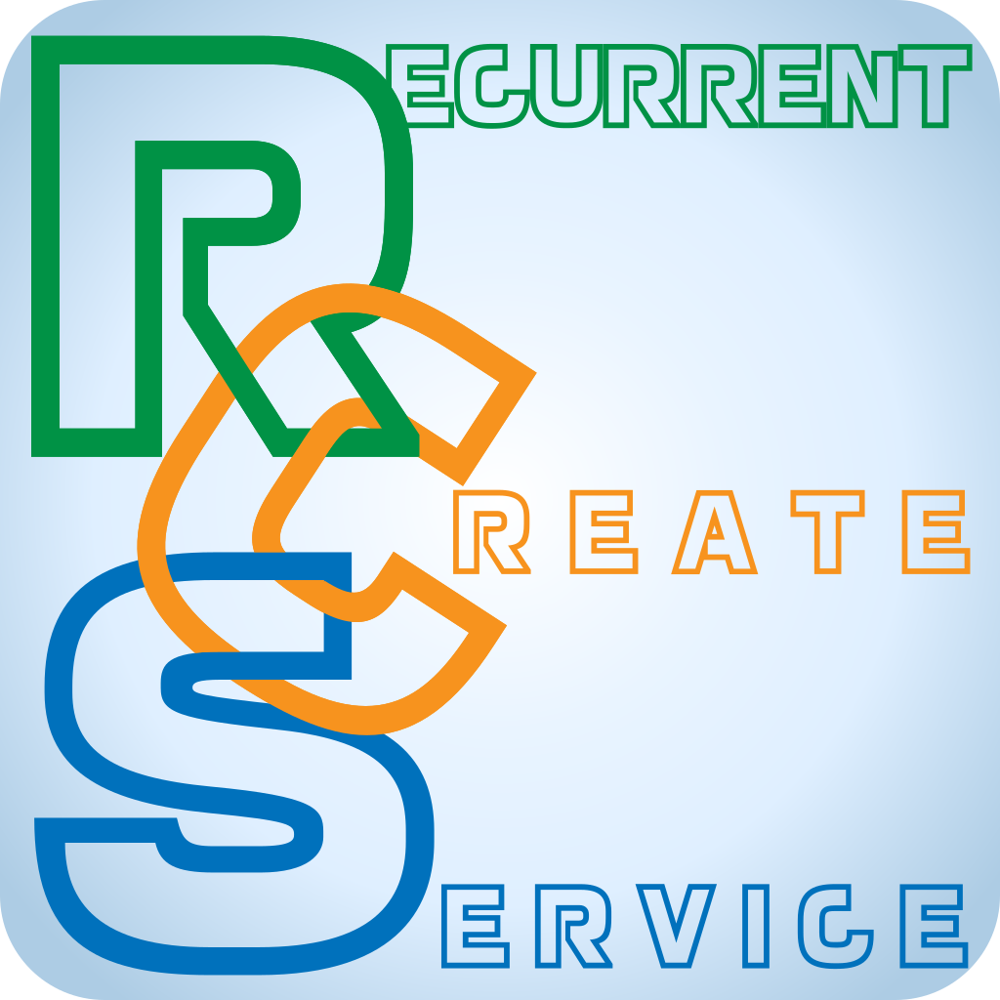
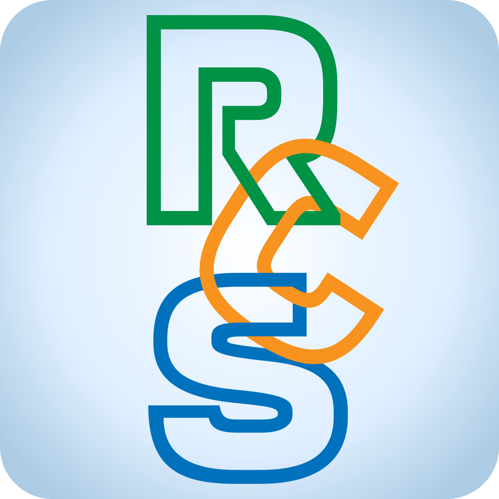

- [デザイン(職業訓練校) - ポートフォリオ に戻る](../2025-11-21-school-design.html)
- [受注側の内容へ](./client-work.html)

## 自身からの相手に依頼
### 架空の会社情報
- **会社名**
  - リカレントクリエイトサービス有限会社
    - 英名：Recurrent Create Service Co., Ltd.
    - 略名：RCS Co., Ltd.
- **設立**：2002年4月（※2006年の会社法施行前に設立された想定）
- **資本金**：300万円
- **所在地**：〒810-0072 福岡県福岡市中央区長浜１丁目4番13号 SF福岡ビル 6階
- **従業員数**：10名
- **主要取引先**： 地元の一般企業、小売店、飲食店など
- **営業時間**：平日 10:00 ～ 19:00（土日祝休業）
- **事業内容**
  - ホームページ制作・保守運用
    - フルカスタマイズ対応
    - CMS対応（WordPress）
  - ランディングページ制作
  - Web広告・チラシ制作
- **依頼内容**
  - 少人数で事業を行っているため、自社HPまで手が回らず、現在のホームページが古いため一新してほしい。
  - 今どきの制作会社のデザインにしてほしい
    - ヘッダー部分のイメージ → <a href="https://www.alleyoop.co.jp/service/corporate/" target="_blank" rel="noopener noreferrer">ALLEYOOP</a>
    - コンテンツ部分のイメージ → <a href="https://buildru.jp/page/lp5/01_3/" target="_blank" rel="noopener noreferrer">Buildru (びるどる)</a>
  - **現在のホームページ想定**  
      
    *picture generated by Gemini3*
  - 完成後は運用・保守もお願いしたい。
- **ロゴ**：作成時間 1h  

